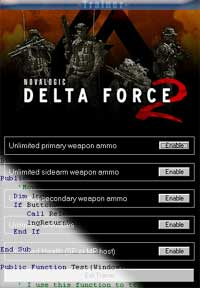



## Delta Force 2 Trainer

### Description

The purpose of this code was to be a good working trainer for Delta Force 2 as well as being an example for memory manipulation in Windows.

I hope someone will find it useful!
 
### More Info
 
The version of Delta Force 2 has to match V1.06.15, or the trainer's functionality will not work.

             |
---                |---
**Submitted On**   |2003-05-07 17:41:20
**By**             |[Cola\-Kattn](https://github.com/Planet-Source-Code/PSCIndex/blob/master/ByAuthor/cola-kattn.md)
**Level**          |Intermediate
**User Rating**    |4.3 (30 globes from 7 users)
**Compatibility**  |VB 6\.0
**Category**       |[Games](https://github.com/Planet-Source-Code/PSCIndex/blob/master/ByCategory/games__1-38.md)
**World**          |[Visual Basic](https://github.com/Planet-Source-Code/PSCIndex/blob/master/ByWorld/visual-basic.md)
**Archive File**   |[Delta\_Forc158478572003\.zip](https://github.com/Planet-Source-Code/cola-kattn-delta-force-2-trainer__1-45323/archive/master.zip)

